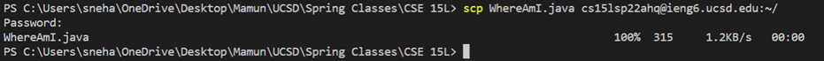

# **LAB REPORT 1 WEEK 2**
# Tutorial For Incoming 15L Students- How To Log Into a Course-specific Account on `ieng6`
------

*  ## *Installing VS Code:*

    1. Go to the Visual Studio Code website https://code.visualstudio.com/

    2. follow the instructions to download and install it on your computer.

    3. When it is installed, you should be able to open a window that looks like this:

         

 ----------------------------------------------------------

* ## *Remotely Connecting:*

    1. install OpenSSH 

    2. Then, look up your course-specific account for CSE15L here:
        https://sdacs.ucsd.edu/~icc/index.php

    3. Open a terminal in VSCode (Ctrl + `, or use the Terminal → New Terminal menu option).
        
        
         Your command will look like this, but with the zz replaced by the letters in your course-specific account.

         $ ssh cs15lsp22zz@ieng6.ucsd.edu

    4.  Since this is likely the first time you’ve connected to this server, you will probably get a message like in the following image.

    5.  type yes and press enter, then give your password. The whole interaction should look something like this once you give your password and are logged in.

        

----------------------------------------------------------

* ## *Trying Some Commands:*
    
    Try running the commands cd, ls, pwd, mkdir, and cp a few times in different ways, both on your computer, and on the remote computer after ssh-ing.

    Here are some specific useful commands to try:

    * cd ~
    * cd
    * ls -lat
    * ls -a
    * ls <directory> where <directory> is /home/linux/ieng6/cs15lsp22/cs15lsp22abc, where the abc is one of the other group members’ username
    * cp /home/linux/ieng6/cs15lsp22/public/hello.txt ~/
    * cat /home/linux/ieng6/cs15lsp22/public/hello.txt

    Here is a preview of how it should look when you are trying the above commands:

    

    --------------------------------------------------------
    

     --------------------------------------------------------
    

     --------------------------------------------------------
    
    
     --------------------------------------------------------
    

----------------------------------------------------------
* ## *Moving Files with scp:*

    1. Create a file on your computer called WhereAmI.java and put the following contents into it:

            class WhereAmI {
                public static void main(String[] args) {
                    System.out.println(System.getProperty("os.name"));
                    System.out.println(System.getProperty("user.name"));
                    System.out.println(System.getProperty("user.home"));
                    System.out.println(System.getProperty("user.dir"));
                }
            }

    2. Run it using javac and java on your computer.

    3. 
        Then, in the terminal from the directory where you made this file, run this command:

        scp WhereAmI.java cs15lsp22zz@ieng6.ucsd.edu:~/

    4. Then, log into ieng6 with ssh again, and use ls. You should see the file there in your home directory! Now you can run it on the ieng6 computer using javac and java. Since java is installed on the server, everyone should be able to run it no matter the client.

    

    ----------------------------------------------------------
    

    ----------------------------------------------------------

    

----------------------------------------------------------

* ## *Setting an SSH Key:*
     ssh-keygen, creates a pair of files called the public key and private key. You copy the public key to a particular location on the server, and the private key in a particular location on the client. Then, the ssh command can use the pair of files in place of your password. This is a common setup step in lots of work environments that involve code on a server.

     Here’s what you should run to set this up:

        on client (your computer)

        $ ssh-keygen

        Generating public/private rsa key pair.

        Enter file in which to save the key (/Users/<user-name>/.ssh/id_rsa): /Users/<user-name>/.ssh/id_rsa

        Enter passphrase (empty for no passphrase): 

        Note: Make sure that you do not add a passphrase for this step.

        Enter same passphrase again: 

        Your identification has been saved in /Users/<user-name>/.ssh/id_rsa.

        Your public key has been saved in /Users/<user-name>/.ssh/id_rsa.pub.

        The key fingerprint is:

        SHA256:jZaZH6fI8E2I1D35hnvGeBePQ4ELOf2Ge+G0XknoXp0 <user-name>@<system>.local

        The key's randomart image is:

        +---[RSA 3072]----+

        |                 |

        |       . . + .   |

        |      . . B o .  |

        |     . . B * +.. |

        |      o S = *.B. |

        |       = = O.*.*+|

        |        + * *.BE+|

        |           +.+.o |

        |             ..  |

        +----[SHA256]-----+

    If you’re on Windows, follow the extra ssh-add steps here: https://docs.microsoft.com/en-us/windows-server/administration/openssh/openssh_keymanagement#user-key-generation

    This is not necessary, do ssh-keygen -t ed25519

    This created two new files on your system; the private key (in a file id_rsa) and the public key (in a file id_rsa.pub), stored in the .ssh directory on your computer.
    Now we need to copy the public (not the private) key to the .ssh directory of your user account on the server.

    $ ssh cs15lsp22zz@ieng6.ucsd.edu
        <Enter Password>

        # now on server

        $ mkdir .ssh

        $ <logout>

        # back on client

        $ scp /Users/<user-name>/.ssh/id_rsa.pub cs15lsp22zz@ieng6.ucsd.edu:~/.ssh/authorized_keys

        # You use your username and the path you saw in the command above

    Once you do this, you should be able to ssh or scp from this client to the server without entering your password.
    
     It should look something like this:
        

----------------------------------------------------------

* ## *Optimizing Remote Running:*
    
    1. You can write a command in quotes at the end of an ssh command to directly run it on the remote server, then exit. For example, this command will log in and list the home directory on the remote server:
    
            $ ssh cs15lsp22zz@ieng6.ucsd.edu "ls"

    2. You can use semicolons to run multiple commands on the same line in most terminals. For example, try:
    
            $ cp WhereAmI.java OtherMain.java; javac OtherMain.java; java WhereAmI
    
    3. You can use the up-arrow on your keyboard to recall the last command that was run.

    

    
