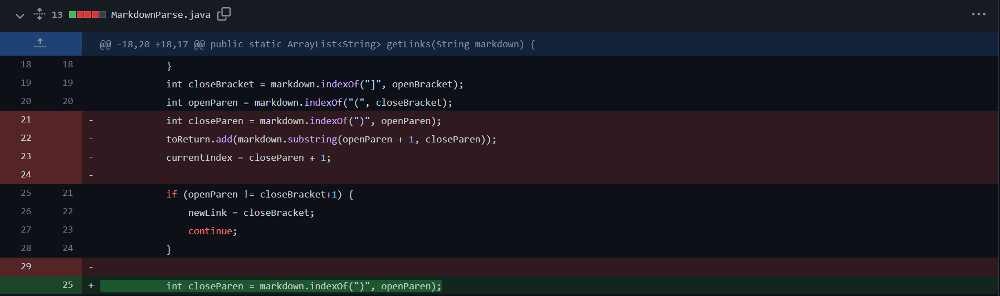

# LAB REPORT 2 WEEK 4

1. The file ran into an issue of an infinite loop due to an extra line at the end of the code. This issue was taken care of my adding an if statement as shown in the below image. Adding the print statement helps us check the current index to figure out the issue.

    Here is the link to the test file with the failure-inducing input:

    [testfile 1](https://github.com/snehalyutika/cse15l-lab-reports/blob/main/test.md)

       

-------------------------------------------------------------

2. The file ran into an isssue because of the existing space inbetween the closed paranthesis and open bracket. This issue was taken care of my adding an if statement as shown in the below image. The if statement checks if there is no open bracket right after the closed paranthesis, it adds a closed bracket and solves the issue.

    Here is the link to the test file with the failure-inducing input:

    [testfile 2](https://github.com/snehalyutika/cse15l-lab-reports/blob/main/test1.md)

    

----------------------------------------------------------------
3. The file ran into an issue as it contained open paranthesis and open bracket with a text in between. This issue was taken care of my adding an if statement as shown in the below image. The if statement checks if there is no closed paranthesis, it breaks out of it. 

    Here is the link to the test file with the failure-inducing input:

    [testfile 3](https://github.com/snehalyutika/cse15l-lab-reports/blob/main/test2.md)

    
-----------------------------------------------------
4.  The file ran into an issue due to an absence of closed paranthesis at the end of the file. This issue was taken care of my adding an if statement as shown in the below image. This chekcs the index of open Bracket and does not give an index out of bound error. 

    Here is the link to the test file with the failure-inducing input:

    [testfile 4](https://github.com/snehalyutika/cse15l-lab-reports/blob/main/test3.md)

   