# LAB REPORT 4 WEEK 8
---------------------------------
- Link to our markdown-parse repository: [Our Repository](https://github.com/ima-quack/markdown-parser)

- Link to markdown-parse repository reviewed : [Reviewed Repository](https://github.com/astoriama/markdown-parser.git)
---------------------------------

# Snippet 1
```
`[a link`](url.com)

[another link](`google.com)`

[`cod[e`](google.com)

[`code]`](ucsd.edu)
```

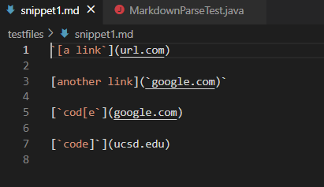

The expected output from getLinks on Snippet 1 should be ['google.com, google.com, ucsd.edu]. According to the CommonMark demo site:

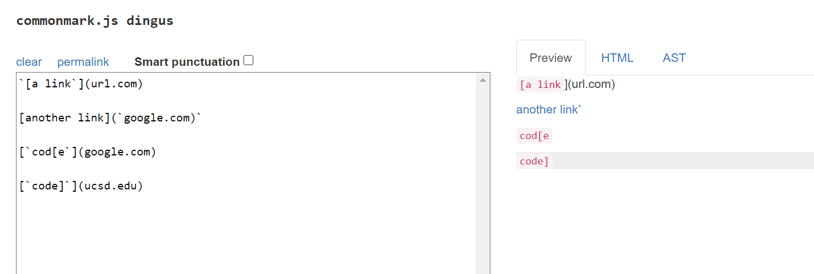

Test in MarkdownParseTest.java for snippet1:

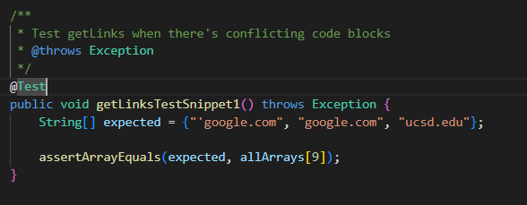

## My Implementation of markdown-parse: 

It did not pass the test.

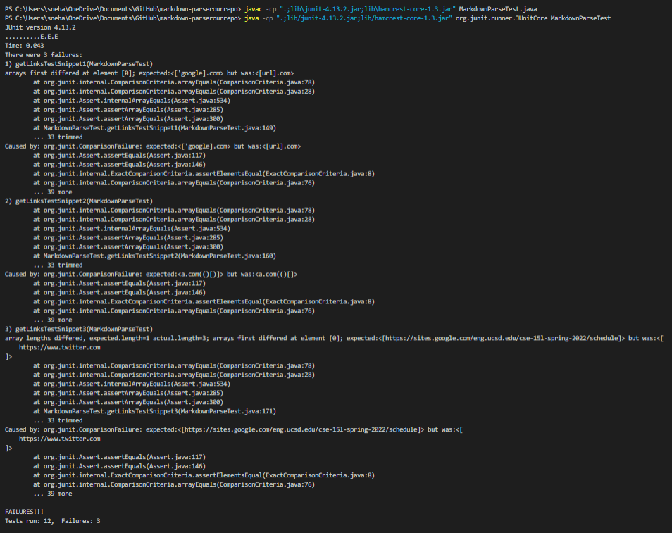


## Reviewed implementation: 

It did not pass the test.

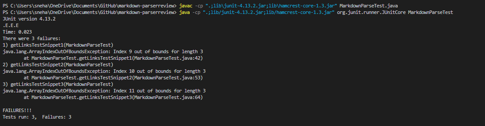
---------------------------

# Snippet 2
```
[a [nested link](a.com)](b.com)

[a nested parenthesized url](a.com(()))

[some escaped \[ brackets \]](example.com)
```

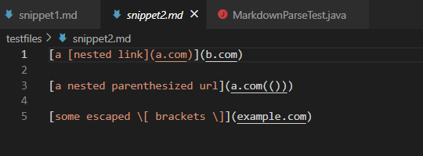

The expected output from getLinks on Snippet 2 should be [a.com, a.com(()), example.com]. According to the CommonMark demo site:

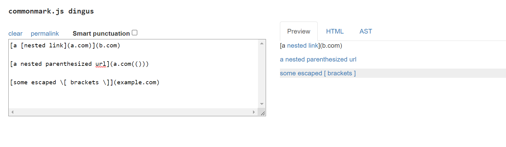

Test in MarkdownParseTest.java for snippet2:

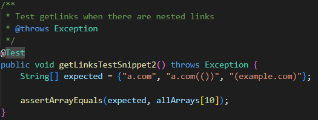

## My Implementation of markdown-parse:

It did not pass the test.


## Reviewed implementation: 

It did not pass the test.


--------------------------------

# Snippet 3

```
[this title text is really long and takes up more than 
one line

and has some line breaks](
    https://www.twitter.com
)

[this title text is really long and takes up more than 
one line](
https://sites.google.com/eng.ucsd.edu/cse-15l-spring-2022/schedule
)


[this link doesn't have a closing parenthesis](github.com

And there's still some more text after that.

[this link doesn't have a closing parenthesis for a while](https://cse.ucsd.edu/


)

And then there's more text
```


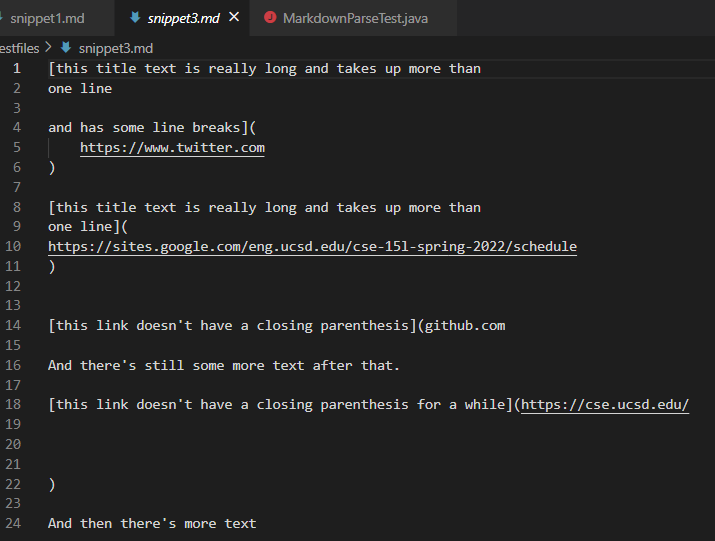

The expected output from getLinks on Snippet 3 should be [https://sites.google.com/eng.ucsd.edu/cse-15l-spring-2022/schedule]. According to the CommonMark demo site:

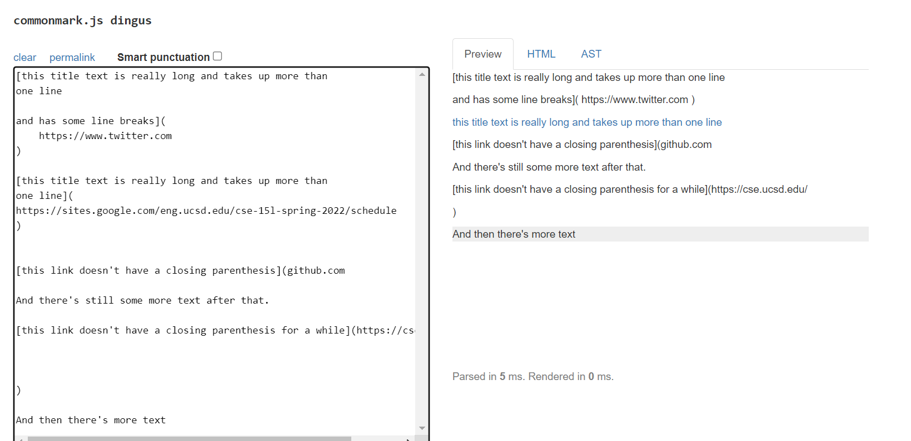

Test in MarkdownParseTest.java for snippet3:

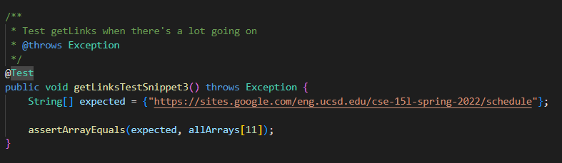

## My Implementation of markdown-parse:

It did not pass the test.


## Reviewed implementation: 

It did not pass the test.


-------------------------------------------------------------
-------------------------------------------------------------

# ANALYSIS
- Snippet 1
    The problem with the first snippet is that the code block signaler ` implies a certain behavior how the links should work. We could possibly make a change which checks if there is a Code Block line before the Open Brackets. 

- Snippet 2
    The problem with the second snippet is that a.com(()) was being cut of half of its last ) and missing the last link. This was because of multiple parenthesis within a.com(()). We would need to check the number of parenthesis within a valid url link. 
    I would require a type of parenthesisMatcher method which may be best paired with a Stack data structure like above.
    
- Snippet 3

    The problem with the third snippet is that our implementation of getLinks does not check for line breaks do not break the parsed links. This fix requires a better way through which line breaks are transcribed through Java Strings as we do not have a way to check if lines are within the url snip currently.


