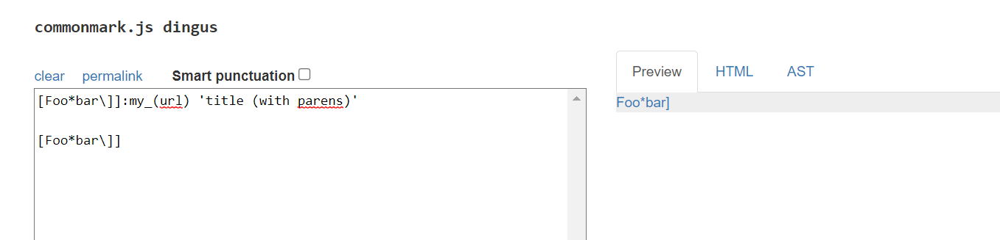

# LAB REPORT 5 WEEK 10
---------------------------------
- Link to my markdown-parse repository: [My Repository](https://github.com/snehalyutika/cse15l-lab-reports.git)

- Link to cloned repository: [Cloned Repository](https://github.com/nidhidhamnani/markdown-parser.git)

-------------------------------------------------------------

## Finding the tests with different results

- I used `bash` scripting methods along with `vimdiff`. 
- I edited the `script.sh` file within the lab cloned repository  by adding in an `echo $file` to print out the file name for each test case.
- I used the copy `cp` command to copy over the `script.sh` file into my repository with my `MarkdownParse.java`. 
- I ran the script using `bash` commands and redirected the output to a text file utilizing `bash script.sh >> results.txt` on both my repository and the cloned repository. Then I used `vimdiff` on both the repositories. 
- Here are the results from my repository on the left and cloned repository on the right:

    

-------------------------------------------------------------

## Test files with different results

Link to test files:
- [Test 22](https://github.com/nidhidhamnani/markdown-parser/blob/8dd87e6914ae40a4321aac8e2483e349de40b03c/test-files/22.md)
- [Test 194](https://github.com/nidhidhamnani/markdown-parser/blob/8dd87e6914ae40a4321aac8e2483e349de40b03c/test-files/194.md)

## Test 22
Here are the results of the test files from cloned repository on the left and my repository on the right: 

link - [Test 22](https://github.com/nidhidhamnani/markdown-parser/blob/8dd87e6914ae40a4321aac8e2483e349de40b03c/test-files/22.md)

According to the [CommonMark demo](https://spec.commonmark.org/dingus/) the correct output should be `[/bar\* “ti\*tle”]`. 

The bug here is because, in the cloned repository, it only adds in a link when there is no space within the `[ ]`. This is plausible as we want our links to not have any spaces within them, but in this case, a space exists due to the regex wildcard search `\*`. A fix could be implemented such that after a `\`, the `MarkdownParse.java` should check to see is there are regex symbols or not.

-----------------

## Test 194
Here are the results of the test files from cloned repository on the left and my repository on the right: 

link -  [Test 194](https://github.com/nidhidhamnani/markdown-parser/blob/8dd87e6914ae40a4321aac8e2483e349de40b03c/test-files/194.md)

According to the [CommonMark demo](https://spec.commonmark.org/dingus/) the correct output should be `[url]`.

In this test, the cloned repository's implementation is correct. The bug within my version of `MarkdownParse.java` might be because as Markdown contains self-reference links within the document where something can be created into a link to a section by adding `[]:`. A possible fix could be to add an array storing words within `[]` if it is followed by a `:` then check to see if there are valid text following the `:.` If the word appears again within the document, compare it with the array storing the words to check it exists and skip the additional checks for links.

